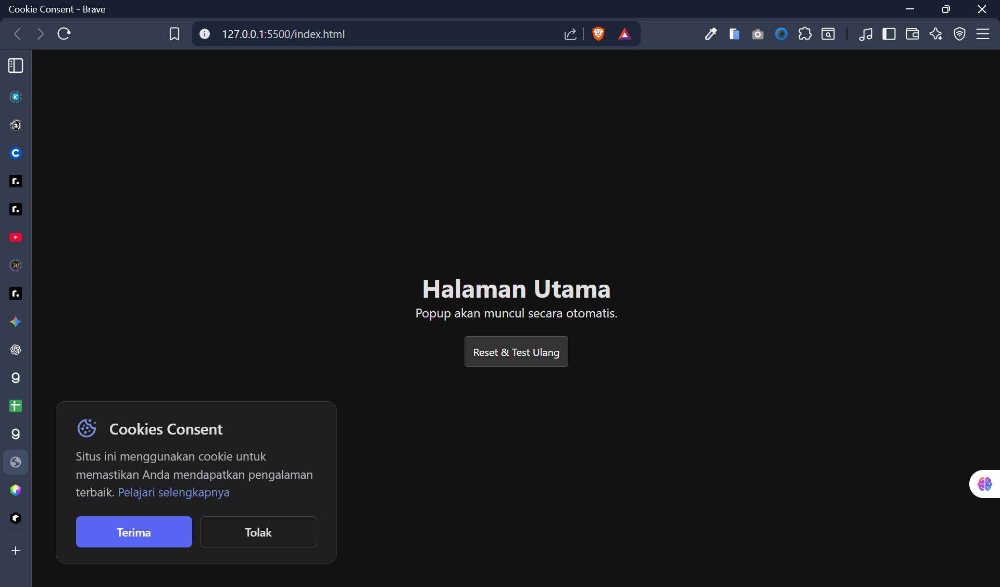

# Cookie Consent Popup

A modern, dark-themed cookie consent popup solution built with vanilla JavaScript. This project is a submission for the [Cookie Consent Project](https://roadmap.sh/projects/cookie-consent) challenge on roadmap.sh.



## 🌟 Features

- **Dark Mode UI**: A sleek, modern interface designed with accessibility and aesthetics in mind.
- **Data Persistence**: Uses `localStorage` to remember the user's choice. Once the user accepts or declines, the popup will not appear on subsequent visits (unless cleared).
- **Responsive Design**: Fully responsive layout that adapts to mobile and desktop screens.
- **Smooth Animations**: CSS transitions for a smooth slide-up entry effect.
- **DOM Manipulation**: Pure JavaScript implementation without external libraries (except Boxicons for the icon).

## 🛠️ Technologies Used

- **HTML5**: Semantic structure.
- **CSS3**: Flexbox, Media Queries, and Transitions.
- **JavaScript (ES6+)**: Event handling and LocalStorage logic.

## 🚀 How to Run

1. Clone this repository or download the files.
2. Open the `index.html` file in your preferred web browser.
3. The popup will appear after a short delay (1 second).

> **Testing Note:** To see the popup again after clicking "Accept" or "Decline", use the **"Reset & Test Ulang"** button provided on the page, or manually clear your browser's Local Storage.

## 📂 Project Structure

```text
/
├── index.html          # Main HTML structure and JavaScript logic
├── Project-image.png   # Preview image for README
└── README.md           # Project documentation

---

## 🔗 Acknowledgments

Tantangan ini adalah bagian dari kurikulum Frontend Developer di [roadmap.sh](https://roadmap.sh).
Link Project: [ttps://roadmap.sh/projects/cookie-consent](ttps://roadmap.sh/projects/cookie-consent)

---
*Created by ❤️ Arizal Anshori*